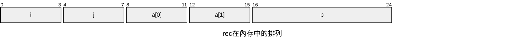
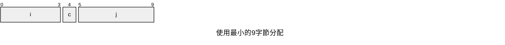
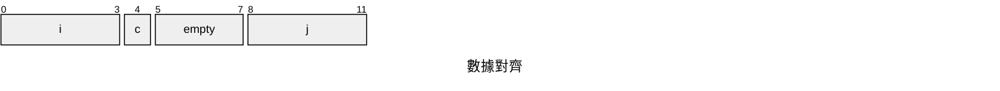

### 程序編碼

#### 機器級代碼

x86-64的虛擬地址由64位的字表示，但在目前實現中，地址的高16位必須設為0，所以實際能指定的範圍是2^48 = 256TB的一個字節。

### 數據格式

* 字(word)：16位
* 雙字(double words)：32位
* 四字(quad words)：64位

| C聲明  | Intel數據類型 | 匯編代碼後輟 | 大小(字節) |
| ------ | ------------- | ------------ | ---------- |
| char   | 字節          | b            | 1          |
| short  | 字            | w            | 2          |
| int    | 雙字          | l            | 4          |
| long   | 四字          | q            | 8          |
| char*  | 四字          | q            | 8          |
| float  | 單精度        | s            | 4          |
| double | 雙精度        | l            | 8          |

### 訪問信息

一個x86-64的CPU單元包含一組16個儲存64位值的**通用目的寄存器**，用來儲存數值和指針。由%rax到%rsp，與%r8到%r15。

%rax：返回值

%rbx：被調用者保存

%rcx：第4個參數

%rdx：第3個參數

%rsi：第2個參數

%rdi：第1個參數

%rbp：被調用者保存

%rsp：棧指針

%r8：第5個參數

%r9：第6個參數

%r10：調用者保存

%r11：調用者保存

%r12：被調用者保存

%r13：被調用者保存

%r14：被調用者保存

%r15：被調用者保存

訪問低位；

* %rax -> %eax -> %ax -> %al
* %r8 -> %r8d -> %r8w -> %r8b

生成小於8字節指令：

* 生成1或2字節：保持剩下字節不變
* 生成4字節：將高位4個字節置為0

#### 操作數指示符

操作數(operand)：指示要使用的原數據值與存放結果的位置

1. 立即數(immediate)：常數

   ATT格式中，立即數的表示為：'$'後跟標準C表示法表示的整數

   例如：$-577或$0x1F

2. 寄存器(register)：表示某個寄存器中的內容

   在下表中，我以r_a表示任意寄存器a，用引用R[r_a]表示他的值

3. 內存引用：根據有效地址訪問某個內存地址

   以M_b[Addr]表示對儲存在內存中從地址Addr開始的b個字節的引用

下表展示不同**尋址模式**，如表底所用Imm(r_b, r_i, s)為最常用的形式。一個立即數偏移Imm，一個基址寄存器r_b，一個變址寄存器r_i和一個比例因子s，其中，s必須是1、2、4、8。基址和變址寄存器都必須是64位寄存器。有效地址被記算為`Imm + R[r_b] +R[r_i] * s。

 

| 類型   | 格式             | 操作數值                     | 名稱                 |
| ------ | ---------------- | ---------------------------- | -------------------- |
| 立即數 | $Imm             | Imm                          | 立即數尋址           |
| 寄存器 | r_a              | R[r_a]                       | 寄存器尋址           |
| 存儲器 | Imm              | M[Imm]                       | 絕對尋址             |
| 存儲器 | (r_a)            | M[R[r_a]]                    | 間接尋址             |
| 存儲器 | Imm(r_b)         | M[Imm + R[r_b]]              | (基址 + 偏移量) 尋址 |
| 存儲器 | (r_b, r_i)       | M[R[r_b] + R[r_i]]           | 變址尋址             |
| 存儲器 | Imm(r_b, r_i)    | M[Imm + R[r_b] + R[r_i]]     | 變址尋址             |
| 存儲器 | (,r_i, s)        | M[R[r_i] * s]                | 比例變址尋址         |
| 存儲器 | Imm(,r_i, s)     | M[Imm + R[r_i] * s]          | 比例變址尋址         |
| 存儲器 | (r_b, r_i, s)    | M[R[r_b] + R[r_i] * s]       | 比例變址尋址         |
| 存儲器 | Imm(r_b, r_i, s) | M[Imm + R[r_b] + R[r_i] * s] | 比例變址尋址         |

#### 練習題

3.1

| 操作數                          | 值       |
| ------------------------------- | -------- |
| %rax                            | 0x100    |
| 0x104                           | 0xAB     |
| $0x108                          | 0x108    |
| (%rax)                          | 0xFF     |
| 4(%rax)                         | 0xAB     |
| 9(%rax, %rdx)                   | 0x11     |
| 260(%rcx, %rdx) // 此處260為dec | **0x13** |
| 0xFC(, %rcx, 4)                 | 0xFF     |
| (%rax, %rdx, 4)                 | 0x11     |

#### 數據傳送指令

**MOV類**：movb, movw, movl, movq, movabsq

一般來說，MOV指令只會更新目的操作數指定的寄存器字節或內存地址。

例外：**若movl以寄存器為目的時，他會把該寄存器的高位4字節設為0**

**MOVZ類**：**零拓展**複製

**MOVS類**：**符號拓展**複製，其中cltq將%eax拓展為%rax

#### 練習題

3.2

movl

movw

movb

movb

movq

movw

3.3

**在64位系統下，使用(%ebx)32位地址會造成不可預知的錯誤** ^49e227

%rax並不是4字節

源與目的不能都是內存地址

沒有%sl這個寄存器

不能將值賦予立即數$0x123

%rdx不是4字節

%rbp並不是1字節

3.4

`src_t *sp`

`dest_t *dp;`

*`dp = (dest_t) *sp;`

其中sp存在%rdi，dp存在%rsi

long -> long：

``` assembly
movq (%rdi), (%rax)
movq %rax, (%rsi)
```

char -> int

``` assembly
movsbl (%rdi), %eax
movl %eax, (%rsi)
```

char -> unsigned

``` assembly
movsbl (%rdi), %eax
movl %eax, (%rsi)
```

unsigned char -> long

注意：此處**沒有**指令為movzbq

``` assembly
movzbl (%rdi), %eax
movq %rax, (%rsi)
```

int -> char

``` assembly
movl (%rdi), %eax
movb %al, (%rsi)
```

unsigned -> unsigned char

``` assembly
movl (%rdi), %(eax)
movb %al, (%rsi)
```

char -> short

``` assembly
movsbw (%rdi), %ax
movw %ax, (%rsi)
```

3.5

``` C++
// %rdi: xp, %rsi: yp, %rdx: zp
void decode1(long *xp, long *yp, long *zp) {
    long a, b, c;
    a = *xp;
    b = *yp;
    c = *zp;
    *yp = a;
    *zp = b;
    *xp = c;
}
```

#### 壓入和彈出棧數據

指令

``` assembly
pushq %rbp
```

等價於

``` assembly
subq %8, %rsp	; 64位下地址減8，32位下地址減4
movq %rbp, (%rsp)
```

指令

``` assembly
popq %rax
```

等價於

```assembly
movq (%rsp), %rax
addq %8, %rsp	; 注意push與pop的指令順序
```

### 算數與邏輯操作

| 指令 |               描述               |
| :--: | :------------------------------: |
| NEG  |               取負               |
| IMUL |                乘                |
| SAL  |               左移               |
| SHL  |         左移(相等於SAL)          |
| SAR  | 算術右移(shift arithmetic right) |
| SHR  |  邏輯右移(shift logical right)   |
| ...  |               ...                |

#### 加載有效地址

leaq和movq的差別：

* leaq：讀取源操作數**地址**並賦予目標操作數
* movq：讀取源操作數**地址中存放的值**並賦予目標操作數

#### 練習題

3.6

%rax = x

%rcx = y

| 表達式                      | 結果   |
| --------------------------- | ------ |
| leaq 6(%rax), %rdx          | 6+x    |
| leaq (%rax, %rcx), %rdx     | x+y    |
| leaq (%rax, %rcx, 4), %rdx  | x+4y   |
| leaq 7(%rax, %rax, 8), %rdx | 7+9x   |
| leaq 0xA(, %rcx, 4), %rdx   | 10+4y  |
| leaq 9(%rax, %rcx, 2), %rdx | 9+x+2y |

3.7

``` C++
long t = 5 * x + 2 * y + 8 * z;
```

3.8

| 目的                    | 值                                    |
| ----------------------- | ------------------------------------- |
| %rax = 0x100            | ~~0x101~~ 0xFF+0x3 = 0x100            |
| 8+%rax = 0x108          | A8                                    |
| %rax + 8 * %rdx = 0x118 | ~~176~~ 0x10($16轉hex) * 0x11 = 0x110 |
| 0x10 + %rax = 0x110     | 0x14                                  |
| ~~0x1~~ %rcx            | 0x0                                   |
| ~~0x100~~ %rax          | 0xFD                                  |

3.9

``` assembly
shlq $4, %rax
sarq %cl, %rax
```

3.10

``` c++
long arith2(long x, long y, long z) {
    long t1 = x | y;
    long t2 = t1 >> 3;
    long t3 = ~t2;
    long t4 = z - t3;    
    return t4;
}
```

3.11

A. 將%rdx置零

B. movq $0, %rdx

C. xorq較短(3字節)，movq(7字節)

#### 特殊的算數操作

| 指令  | 描述                     |
| ----- | ------------------------ |
| imulq | 有符號乘法               |
| mulq  | 無符號乘法               |
| cqto  | 四字轉換為八字(符號拓展) |
| idivq | 有符號除法               |
| divq  | 無符號除法               |

mulq/imulq：要求將被乘數儲存在%rax中，乘數由作為指令的操作數提供

idivq：將%rdx的高64位與%rax的低64位做為一個128位的被除數，除數由作為的指令的操作數提供。對於大多數64位應用，被除數應是一個64位值，此值應被存放於%rax中，且%rdx應被設置為全0(U)或%rax的符號位(T)，此操作可由cqto完成。指令將商存在%rax，餘數存在%rdx

cqto：不須操作數，隱含的讀出%rax的符號位，並將他複製到%rdx的所有位中

#### 練習題

3.12

``` assembly
uremdiv:
	movq %rdx, %r8
	movq %rdi, %rax
	movq $0, %rdx
	divq %rsi
	movq %rax, (%r8)
	movq %rdx, (%rcx)
	ret
```

### 控制

#### 條件碼

CF(Carry Flag)：進位標誌。最近的操作使最高位進位。用來**檢查無符號操作的溢出**。

ZF：零標誌。最近的操作得到0。

SF：符號標誌。最近的操作得到的結果為**負數**。

OF：溢出標誌。最近的操作導致一個**補碼**溢出。

其中：

* leaq不會改變任何條件碼
* 邏輯操作，如xor，進位與溢出標誌會被置零
* 移位操作，進位標誌被置為**最後一個被移出的位**，溢出標誌置零
* inc和dec會設置溢出和零標誌，但**不會改變進位標誌**

| 指令            | 基於      |
| ------------- | ------- |
| `CMP S1, S2`  | S2 - S1 |
| `TEST S1, S2` | S2 & S1 |

上表指令只設置條件碼而不改變目的寄存器

#### 訪問條件碼

條件碼通常不會直接讀取，常用的方法有：

1. 根據條件碼組合，將一個字節置0或1：SET指令
2. 條件跳轉
3. 有條件地傳送數據

SET指令：**後輟表示不同條件而不是操作數大小**，目的操作數是低位單字節寄存器或一個字節的內存地址。為得到32或64位結果，需先將高位置零

| 指令    | 同意名 | 效果                | 設置條件   |
| ------- | ------ | ------------------- | ---------- |
| setz D  | sete   | D <- ZF             | 相等/零    |
| setnz D | setne  | D <- ~ZF            | 不等/非零  |
| sets D  |        | D <- SF             | 負數       |
| setns D |        | D <- ~SF            | 非負數     |
| setg D  | setnle | D <- ~(SF^OF) & ~ZF | 大於(T)    |
| setge D | setnl  | D <- ~(SF^OF)       | 大於等於   |
| setl D  | setnge | D <- SF ^ OF        | 小於       |
| setle D | setng  | D <- (SF^OF) \| ZF  | 小於等於   |
| seta D  | setnbe | D <- ~CF & ~ZF      | 超過(U)    |
| setae D | setnb  | D <- ~CF            | 超過或相等 |
| setb D  | setnae | D <- CF             | 低於       |
| setbe D | setna  | D <- CF \| ZF       | 低於或相等 |

計算a < b (long)的彙編指令如下所示

``` assembly
comp:
	cmpq %rsi, %rdi
	setl %al		 ; Set low-order byte of %eax to 0 or 1
	movzbl %al, %eax ; Clear rest of %eax (and rest of %rax)
	ret
```

#### 練習題

3.13

A

int a < b


B

short a >= b


C

unsigned char a <= b


D

long a != b

**unsigned long / 某種形式的指針**

3.14

A

long a >= b


B

short / unsinged short  a == b


C

unsigned char a > b


D

int a <= b

#### 跳轉指令

jmp *%rax：以%rax的值做目標

jmp *(%rax)：以%rax的值作為讀地址，從內存中讀出跳轉目標

#### 跳轉指令的編碼

PC相對尋址：假設jmp 後實際編碼的數字是x，jmp的下一條指令地址是y，jmp的目標地址是z。則$z = x + y$

#### 練習題

3.15

A

4003FE


B

400525


C

ja: 400543

pop: 400545


D

F73 = 1111 0111 0011 = -141

400560

#### 用條件控制來實現條件分支

``` C++
if (test-expr)
    then-statement
else
    else-statement
```

轉換成彙編邏輯

``` C++
if (!test-expr)
    goto False;
then-statement
goto Done;
False:
	else-statement
Done:
```


#### 練習題

3.16

A

``` C++
void cond(long a, long *p) {
    if(p = 0) {
        goto Done;
    }
    if(*p >= a)	{
    	goto Done;
    }
    *p = a;
Done:
    return;
}
```

B

拆分"&&"操作符

3.17

A

``` C++
long absdiff_se(long x, long y) {
    long result;
    if(x < y)
        goto True;
    ge_cnt++;
    goto Done;
True:
    lt_cnt++;
    result = y - x;

Done:
    return result;
}
```

B

不行。

3.18

``` C++
long test(long x, long y, long z) {
    long val = x + y + z;
    if(x < -3) {
        if(y < z) {
            va; = x * y;
        }
        else {
            val = y * z;
        }
    }
    else if(x > 2) {
        val = x * z;
    }
    return val;
}
```

#### 用條件傳送來實現條件分支

處理器運行時依靠預讀取連續指令來提升性能，但當執行到條件跳轉時，處理器並不知道接下來要跳轉與否。處理器使用分支預測邏輯來猜測跳轉指令是否會執行，若猜測錯誤，則浪費多個時間週期。
$$
\begin{align}
&設執行代碼的時間T_{ok}，預測錯誤的處罰是T_{MP}，預測錯誤的機率是p \\
&那麼執行代碼的平均時間是： \\
&T_{avg}(p) = (1 - p)T_{ok} + p(T_{ok} + T_{MP}) \\
&= T_{ok} + pT_{MP}
\end{align}
$$

條件傳送指令：當條件被滿足時方執行mov，且源和目的的值可以是16位、32位或64位，不支持單字節的條件傳送。且其mov不須加操作數長度單位，彙編器可以從目標寄存器的名字推斷出條件傳送指令的操作數長度。

ex：cmovz / cmovg / cmova

``` C++
v = test-expr ? then-expr : else-expr;
```

使用**條件控制**轉移後轉為

``` C++
if(!test-expr)
    goto False;
v = then-expr;
goto Done;
False:
	v = else-expr;
Done:
```

使用條件傳送則為

``` C++
t = test-expr;
v = then-expr;
ve = else-expr;
if(!t) v = ve;
```

代碼的最後一條使用條件傳送實現

#### 練習題

3.19

A

T_ok = 16

T_avg(0.5) = 16 + 0.5 * T_MP = 31

=> T_MP = 30

B

T_ok + T_MP = 16 + 30 = 46

3.20

-16

``` C++
#define OP /

long arith(long x) {
    return x OP 8;
}
```

``` assembly
; long arith(long x)
; x in %rdi
arith:
	leaq 7(%rdi), %rax ; v = 7 + x
	testq %rdi, %rdi
	cmovns %rdi, %rax ; if x >= 0, v = x
	sarq %3, %rax ; v /= 8
	ret
```

注意，**如果x為負數，需要加上偏移量(2^k)-1 = 7**，這是因為取整的方式不同

若為數學除法，則為向零取整，可位移操作是向下取整，所以需要調整。即：
$$
\lfloor{\frac{x + (2^k-1)}{2^k}}\rfloor = \lceil{\frac{x}{2^k}}\rceil
$$
3.21

``` C++
long test(long x, long y) {
    long val = x * 8;
    if(y > 0) {
        if(x < y)
            val = y - x;
        else
            val = x & y;
    }
    else if(y <= -2) 
        val = x + y;
    retunr val;
}
```

#### 循環

##### do-while循環

``` C++
do
    body-statement
    while (test-expr)
```

翻譯為

``` C+
loop:
	body-statement
	t = test-expr;
	if (t)
		goto loop;
```

##### while循環

``` C++
while (test-expr)
    body-statement
```

1. 跳轉到中間(jump to middle)：

``` C++
	goto Test;
Loop:
	body-statement
Test:
	t = test-expr;
	if (t)
        goto Loop;
```

2. guarded-do：

``` C++
t = test-expr;
if (!t)
    goto Done;
Loop:
	body-statement
	t = test-expr;
	if (t)
        goto Loop;
Done:
```

##### for循環

``` C++
for (init-expr; test-expr; update-expr)
    body-statement
```

等價於

``` C++
init-expr;
while (test-expr) {
    body-statement
	update-expr;
}
```

jump to middle: 

``` C++
init-expr;
goto Test;
Loop:
	body-expr;
	update-expr;
Test:
	t = test-expr;
	if (t)
        got Loop;
```

guarded-do:

``` C++
inti-expr;
t = test-expr;
if (!t)
    goto Done;
Loop:
	body-statement
	update-expr;
	t = test-expr;
	if (t)
        goto Loop;
Done:
```

#### 練習題

3.22

略

3.23

``` assembly
dw_loop:
	movq %rdi, %rax ; %rax = x
	movq %rdi, %rcx ; %rcx = x
	imulq %rdi, %rcx ; %rcx = y = x * x
	leaq (rdi, %rdi), %rdx ; %rdx = n
.L2:
	leaq 1(%rcx, %rax), %rax ; x = 1 + y + x
	subq $1, %rdx ; n--
	testq %rdx, %rdx
	jg .L2 ; while(rdx > 0)
	rep; ret
```

A

x in %rax, y in %rcx and n in %rdx

B

以leaq 1(%rcx, %rax), %rax一行直接表示x += y;與(*p)++;

3.24

``` C++
long loop-while(long a, long b) {
    long result = 1;
    while (a < b) {
        result = result * (a + b);
        a = a + 1;
    }
    return result;
}
```

3.25

``` C++
long loop_while2(long a, long b) {
    long result = b;
    while (b > 0) {
        result = result * a;
        b = b - a;
    }
    return result;
}
```

3.26

A

jump to middle

B

``` C++
long fun_a(unsigned long x) {
    long val = 0;
    while (x != 0) {
        val ^= x;
        x >>= 1;
    }
    return val & 1;
}
```

C

**計算x的奇偶，即x有奇數個1返回1，否則返回0**

3.27

``` C++
long fact_for_gd_goto(long n) {
    long i = 2;
    long result = 1;
    if (i > n)
        goto Done;
Loop:
    result *= i;
    i++;
    if(i <= n)
        goto Loop;
Done:
    return result;
}
```

3.28

A

``` C++
long fun_b(unsigned long x) {
    long val = 0;
    long i;
    for (i = 64; i != 0; i--;) {
        val = (val << 1) | (x & 0x1);
        x >>= 1;
    }
    return val;
}
```

B

因為i初始化為64，必不可能等於0

C

**反轉x的位**

3.29

A

update-expr不會被執行，導致死循環

B

直接goto update-expr部分，而不是跳過整個while循環

#### switch語句

switch使用跳轉表(jump table)實現。跳轉表是一個數組，表項i是一個代碼段的地址，相當於switch索引值是i時該採取的動作

其中，&&創建一指向代碼位置的指針

``` c++
static void *jt[7] = {
    &&loc_A, &&loc_def, &&loc_B,
    %%loc_C, &&loc_D, &&loc_def,
    &&loc_D
};
unsigned long index = n;
goto *jt[index];

loc_A:
loc_B:
loc_C:
loc_D:
loc_def:
```

#### 練習題

3.30

A

-1 0 1 2 4 5 7

B

0 7 2 4

3.31

``` c++
// default = .L2
// 0 2 4 5 7
void switcher(long a, long b, long c, long *dest) {
    long val;
    switch (a) {
	case 5:
		c = b ^ 15;
	case 0:
		val = 112 + c;
		break;
	case 2:
	case 7:
		val = (b + c) << 2;
		break;
	case 4:
		val = a;
		break;	
	default:
		val = b;
    }
}
```

### 過程

* 傳遞控制：進入過程Q時，程序計數器必須被設置為Q的代碼起始地址，返回時必須設置為調用Q後面那條指令的地址
* 傳遞數據：調用者必須能夠向過程Q提供一個或多個參數，Q必須能夠向調用者返回一個值
* 分配和釋放內存：在開始時，Q可能需要為局部變量分配空間。在返回前，必須釋放這些儲存空間

#### 傳遞控制

調用函數Q時，程序計數器(PC)設置為Q的起始位置，同時壓入返回地址，該動作由指令call Q完成。對應的指令ret會將返回地址彈出，並將PC設為返回地址

#### 練習題

3.32

| 標號 | PC       | 指令      | %rdi | %rsi | %rax | %rsp           | *%rsp    | 描述            |
| ---- | -------- | --------- | ---- | ---- | ---- | -------------- | -------- | --------------- |
| M1   | 0x400560 | callq     | 10   | -    | -    | 0x7fffffffe820 | -        | 調用first(10)   |
| F1   | 0x400548 | lea       | 10   | -    | -    | 0x7fffffffe818 | 0x400565 | 進入first       |
| F2   | 0x40054c | sub       | 10   | 11   | -    | 0x7fffffffe818 | 0x400565 | 繼續first       |
| F3   | 0x400550 | callq     | 9    | 11   | -    | 0x7fffffffe818 | 0x400565 | 調用last(9, 11) |
| L1   | 0x400540 | mov       | 9    | 11   | -    | 0x7fffffffe810 | 0x400555 | 進入last        |
| L2   | 0x400543 | imul      | 9    | 11   | 9    | 0x7fffffffe810 | 0x400555 | 繼續last        |
| L3   | 0x400547 | retq      | 9    | 11   | 99   | 0x7fffffffe810 | 0x400555 | 從last返回99    |
| F4   | 0x400555 | repz retq | 9    | 11   | 99   | 0x7fffffffe818 | 0x400565 | 從first返回99   |
| M2   | 0x400565 | mov       | 9    | 11   | 99   | 0x7fffffffe820 | -        | 繼續main        |

#### 數據傳輸

x86-64中，最多通過寄存器傳遞6個整型參數(整數和指針)，若有大於6個整型參數，超出部分則用棧傳遞

| 操作數大小(位) | 1    | 2    | 3    | 4    | 5    | 6    |
| -------- | ---- | ---- | ---- | ---- | ---- | ---- |
| 64       | %rdi | %rsi | %rdx | %rcx | %r8  | %r9  |
| 32       | %edi | %esi | %edx | %ecx | %r8d | %r9d |
| 16       | %di  | %si  | %dx  | %cx  | %r8w | %r9w |
| 8        | %dil | %sil | %dl  | %cl  | %r8b | %r9b |
^DataTransfer

#### 練習題

3.33

``` C++
/*
* %rdx: u
* %rcx: v
* %edi: a
* %sil: b
*/

// Since both function can be implemented by the same assembly code, so the order of a, b isn't very important
int procprob(int a, short b, long *u, char* v); 
int procprob(int b, short a, long *v, char* u);
```

#### 棧上的局部儲存

在以下三種情況下，局部數據必須存放在內存中

* 寄存器不足夠存放所有的本地數據
* 對一個局部變量使用"&"，因為必須為它產生一個地址
* 此局部變量是數組或結構，所以必須能通過數組或結構引用被訪問到

通常，過程通過減小棧指針的值在棧上分配空間，分配的結果作為棧幀的一部份。離開時，加回減少的值即可

#### 寄存器中的局部儲存空間

以%rbx、%rbp和%r12~%r15被劃分為==被調用者保存寄存器==當過程P調用過程Q時，Q必須==保存這些寄存器的值==，使從Q返回到P時這些寄存器的值保持不變

其他寄存器，除了%rsp，稱為==調用者保存寄存器==，即任何函數都能修改它們

#### 練習題

3.34

A
$a_0 \sim a_5$ 

B
$a_6 \sim a_7$ 

C
~~需要保存Q返回的值~~ 被調用者保存寄存器被用盡

3.35

A
x

B
``` C++
long rfun(unsigned long x) {
	if (x == 0)
		return 0;
	unsigned long nx = x >> 2;
	long rv = rfun(nx);
	return x + rv;
}
```

### 數組分配與訪問

#### 基本原則

對於數據類型$T$和整形常數$N$，聲明如下:
`T A[N];` 

起始位置表示為$x_A$

首先，此聲明會在內存中分配一個$L(T的字節大小) \cdot N$字節的連接區域。其次，引入標示符$A$，表示指向數組開頭的指針，其值為$x_A$

並使用$0 \sim N - 1$的索引訪問數組，元素$i$會被存放在地址$x_A + L \cdot i$的地方

x86-64使用內存引用指令訪問數組，假設E是int型數組，且E存放於%rdx，i存放於%rcx，則訪問`E[i]`的指令為: 
`movl (%rdx, %rcx, 4), %eax`

即，$x_E + 4i$

#### 練習題

3.36

| 數組  | 元素大小 | 整個數組的大小 | 起始地址  | 元素$i$             |
| --- | ---- | ------- | ----- | ----------------- |
| S   | 2    | 14      | $x_S$ | $x_S + i \cdot 2$ |
| T   | 8    | 24      | $x_T$ | $x_T + i \cdot 8$ |
| U   | 8    | 48      | $x_U$ | $x_U + i \cdot 8$ |
| V   | 4    | 32      | $x_V$ | $x_V + i \cdot 4$ |
| W   | 8    | 32      | $x_W$ | $x_W + i \cdot 8$ |

#### 指針運算

若$p$指向$T$，且$p$的值為$x_p$，那麼表達式`p + i`的值為$x_p + L \cdot i$，其中$L$為$T$的大小(字節)

表達式**`Expr`與`* &Expr`是等價的，數組引用`A[i]`與表達式`* (A + i)`也是等價的**


| 表達式         | 類型   | 值           |
| ----------- | ---- | ----------- |
| `&E[2]`     | int* | $x_E + 8$   |
| `E[i]`      | int  | $M[x_E+4i]$ |
| `&E[i] - E` | long | $i$         |
#### 練習題

3.37

S(short)的地址: $x_S$，存放於%rdx

索引$i$存放於: %rcx

| 表達式            | 類型       | 值                 | 匯編代碼                            |
| -------------- | -------- | ----------------- | ------------------------------- |
| `S + 1`        | `short*` | $x_S + 2$         | `leaq 2(%rdx), %rax`            |
| `S[3]`         | `short`  | $M[x_S + 6]$      | `movw 6(%rdx), %ax`             |
| `&S[i]`        | `short*` | $x_S + 2i$        | `leaq (%rdx, %rcx, 2), %rax`    |
| `S[4 * i + 1]` | `short`  | $M[x_S + 8i + 2]$ | `movw 2(%rdx, %rcx, 8), %ax`    |
| `S + i - 5`    | `short*` | $x_S + 2i - 10$   | `leaq -10(%rdx, %rcx, 2). %rax` |

#### 嵌套的數組(多維數組)

若聲明如下數組:
`T D[R][C]`

它的數組元素`D[i][j]`的內存地址為:

$$
\&D[i][j] = x_D + L(C \cdot i + j)
$$

#### 練習題

3.38

``` Assembly
; i in %rdi, j in %rsi
sum_element:
	leaq 0(, %rdi, 8), %rdx ; %rdx = 8i
	subq %rdi, %rdx ; %rdx = 7i
	addq %rsi, %rdx ; %rdx = 7i + j
	leaq (%rsi, %rsi, 4), %rax ; %rax = 5j
	addq %rax, %rdi ; %rdi = i + 5j
	movq Q(, %rdi, 8), %rax ; %rax = Q + 8(i + 5j)
	addq P(, %rdx, 8), %rax ; %rax = [Q + 8(i + 5j)] + [P + 8(7i + j)]
	ret
```

`P[i][j] = P + T(N * i + j)`
`Q[j][i] = Q + T(M * j + i)`

M = 5

N = 7

#### 定長數組

以下展示優化等級為`-O1`時GCC採用的優化

``` C++
#define N 16
typedef int fix_matrixs[N][N];

/* Compute i, k of fixed matrix product */
int fix_prod_ele (fix_matrix A, fix_matrix B, long i, long k) {
	long j;
	int result = 0;

	for (j = 0; j < N; j++)
		result += A[i][j] * B[j][k];

	return result;
}
```
(原始的C代碼)

``` C++
int fix_prod_ele_opt (fix_matrix A, fix_matrix B, long i, long k) {
	int* Aptr = &A[i][0];
	int* Bptr = &B[0][k];
	int* Bend = &B[N][k];
	int result = 0;
	do {
		result += *Aptr * *Bptr;
		Aptr++;
		Bptr += N;
	}
	while (Bptr != Bend);
	return result;
}
```
(優化過的C代碼)

#### 練習題

3.39

$A[i][0]=x_A + 4(16i + 0)$

$B[0][k] = x_B + 4(0 + k)$

$B[N][k] = x_B + 4(16 \times 16 + k)$


3.40

``` C++
void fix_set_diag_opt(fix_matrix A, int val) {
int* Aptr = &A[0][0];
int* Aend = &A[N][N];
do {
	*Aptr = val;
	Aptr += N + 1;
}
while (Aptr != Aend);
}
```
(我的)

``` C++
void fix_set_diag_opt(fix_matrix A, int val) {
int* Aptr = &A[0][0];
long i = 0;
long iend = N*(N+1);
do {
	Aptr[i] = val;
	i += (N+1);
}
while (i != iend);
}
```
(解答的)

(兩個代碼功能完全相同)

### 異質的數據結構

`struct`: 將多個對象集合到一個單位中

`union`: 用幾種不同的類型來引用一個對象

#### 結構

> [!Note] 傳遞結構
> 利用指針可以傳遞結構，而不是複製它們
> ``` C++
> long area(struct rect* rp) {
> 	return (*rp).width * (*rp).height;
> }
> ```
> 注意，此處須使用`(*rp).width`而非`*rp.width`
> 同時，`rp->width`等價於`(*rp).width`
> 

考慮以下結構聲明: 
``` C++
struct rec {
	int i;
	int j;
	int a[2];
	int *p;
};
```


#### 練習題

3.41

A

`p`: 0

`s.x`: 8

`s.y`: 12

`next`: 16

B

24

C

``` C++ 
void sp_init(struct prob *sp) {
	sp->s.x = sp->s.y;
	sp->p = &(sp->s.x);
	sp->next = sp; // Caution: not &(sp->s.x) because its %rdi, not (%rdi)
}
```

3.42

A

```C++ 
long fun(struct ELE *ptr) {
	long result = 0;

	while (ptr) {
		result += ptr->v;
		ptr = ptr->p;
	}

	return result;
}
```

B

ELE為數據結構: 鏈表，fun實現功能為加總鏈表的和

#### 聯合(union)

考慮以下聲明: 

``` C++
union U3 {
	char c;
	int i[2];
	double v;
}
```

對於`union U3 *p`，`p->c`、`p->i[0]`、`p->v`引用的都是==數據結構的起始位置==。而且，==一個聯合的總大小等於最大字段的大小==

使用`union`的好處: 

* **減少分配空間總量**

``` C++
struct node_s {
	struct node_s *left;
	struct node_s *right;
	double data[2];
};
```
(占用32字節)

``` C++
typedef enum {N_LEAF, N_INTERNAL} nodetype_t;
struct node_t {
	nodetype_t type;
	union {
		struct {
			struct node_t *left;
			sturct node_t *right;
		} internal;
		double data[2];
	} info;
};
```
(占用24字節: 4字節的type，16字節的data，type和聯合之間的4字節填充)

* **訪問不同類型的位模式**

``` C++
double uu2double(unsigned word0, unsigned word1) {
	union {
		double d;
		unsigned u[2];
	} temp;

	temp.u[0] = word0;
	temp.u[1] = word1;
	return tmep.d;
}
```

 > [!Warning] 注意
 > 如上的函數位模式轉換需要注意機器的大小端，因為`word0`與`word1`代表的4字節在大小端機器上剛好相反
 
#### 練習題

3.43

略，不想寫

> [!Warning] 注意
> ``` C++
> typedef union {
> 	struct {
> 		long u;
> 		short v;
> 		char w;
> 	} t1;
> 	struct {
> 		int a[2];
> 		char *p;
> 	}t2;
> }utype;
> ```
> 若`union`中包含`struct`，則訪問變量時，`t1`中`u`的偏移量為0，`t1`中`v`的偏移量為8。`t2`中`a`的偏移量為0，`t2`中`p`的偏移量為8

#### 數據對齊

==K字節的類型，地址必須是K的倍數==

對於包含結構的代碼，編譯器可能需要在==字段的分配中插入間隙==，保證每個元素都滿足對齊要求

考慮以下結構: 

``` C++
struct S1 {
	int i;
	char c;
	int j;
};
```




> [!Warning] 注意
> 因為要保證數據對齊，所以若有指針指向S1，編譯器必須保證此指針的地址也為4的倍數

#### 練習題

3.44

A

16

B

16

C

10

D

40

E

40

3.45

``` C++
struct {
	char *a;    // 8
	short b;    // 2
	double c;   // 8
	char d;     // 1
	float e;    // 4
	char f;     // 1
	long g;     // 8
	int h;      // 4
};
```

A

52

B

56(滿足第一項char *a的對齊)

C

``` C++
struct {
	char *a;
	double c;
	long g;
	float e;
	int h;
	short b;
	char d;
	char f;
} rec;
```

~~36~~ 40 (不對齊的大小為36字節，但偏移量為35，所以必須將地址對齊到40)

### 在機器級程序終將控制與數據結合起來

#### 理解指針

* **每個指針都對應一個類型**
	特殊的，`void *`類型代表通用指針。==指針類型**不是機器代碼中的一部份**==，它們是C語言提供的一種抽象，幫助程序員避免尋址錯誤。

* **每個指針都有一個值**
	特殊的，NULL(0)表示該指針沒有指向任何地方

* **將指針從一種類型強制轉換到另一種類型，只改變它的類型，而不改變它的值**
	例如，`p`是一個`char *`類型指針，它的值為`p`。則表達式`(int *)p + 7`計算為`p + 28`，而`(int *)(p + 7)`計算為`p + 7` (強制類型轉換的優先級高於加法)

* **指針也可以指向函數**(函數指針)
	假設我們有一個函數: 
	``` C++
	int fun(int x, int *p);
	```
	然後，我們可以聲明一個指針`fp`，將它賦予這個函數: 
	``` C++
	int (*fp)(int, int *);
	fp = fun
	```
	然後用這個指針來調用函數: 
	``` C++
	int y = 1;
	int result = fp(3, &y);
	```

#### 內存越界引用和緩衝區溢出

**緩衝區溢出(buffer overflow)**：例如，在棧中分配某個字符數組來保存一個字符串，但字符串長度超過分配的空間就會發生這種問題。

#### 練習題

3.46

A

01 23 45 67 89 AB CD EF: push %rbx的值

null

null <- %rsp

(我猜測此處sub %0x10, %rsp是為了數據對齊)

B

> [!Warning] 注意
> `gets()`函數讀取的值會在棧上朝高地址處增長


00 00 00 00 00 40 00 34: 返回地址

33 32 31 30 39 38 37 36: push %rbx的值

35 34 33 32 31 30 39 38

37 36 35 34 33 32 31 30 <- %rsp

C

`0x400034`

D

%rbx

E

使用`strlen(buf) + 1`取代`strlen(buf)`，且代碼還需檢查返回是否為NULL

> [!Warning] 注意
> `strlen()`計算的是字符串可見字符的長度，即不包含結尾的`'\0'`，所以需要使用`strlen(buf) + 1`取代`strlen(buf)`

#### 對抗緩衝區溢出攻擊

1. 棧隨機化
	地址空間布局隨機化(Address-Space Layout Rndomization ASLR)
	
	如何破解?
	使用一種叫做nop sled(空操作雪橇)的技術。即在shellcode前面插入很長一段nop，如果EIP返回到nop sled的任意地址，那麼在達到shellcode之前，每執行一條nop指令EIP都會遞增。也就是說，只要返回地址被nop sled所覆蓋，EIP就會將sled滑向shellcode

2. 棧破壞檢測
	在棧幀中任何局部緩衝區與棧狀態間儲存一個金絲雀(canary)值，亦稱為哨兵值(guard value)，此值在每次運行時隨機產生。在恢復寄存器狀態和從函數返回前，會檢查這個金絲雀值使否被更改，若更改則程序異常終止

3. 限制可執行代碼區域
	限制只有編譯器產生的代碼部分內存可執行，其他部分被限制為只允許讀和寫

#### 練習題

3.47

A

8192 = $2^{13}$

B

128 = $2^{7}$
$\frac{2^{13}}{2^{7}} = 2^{6} = 64$

3.48

A

a)
	buf: %rdi，即%rsp
	v: %rsi, 即%rsp+24
	不存在金絲雀值

b)
	buf: %rdi，即%rsp + 16
	v: %rsi，即%rsp+8
	canary: %rsp+40

B

將v放在比buf更低地址處，這樣就算溢出也不會覆蓋v的值，而是會先覆蓋到金絲雀值

#### 支持變長棧幀

我們目前見過的代碼在編譯期就可以確認棧幀大小，但有些函數的局部儲存需要在運行期間才能確定，比如使用`malloc`申請的內存

以下代碼需要分配一個局部變量`i`，且含有一個含有n項的變長數組，這要求在棧上分配8n個字節。

``` C++
long vframe(long n, long idx, long *q) {
	long i;
	long *p[n];
	p[0] = &i;
	for (i = 1; i < n; i++)
		p[i] = q;
	return *p;
}
```

``` Assembly
; n in %rdi, idx in %rsi, q in %rdx
vframe:
	pushq %rbp
	mov %rsp, %rbp
	subq $16, %rsp    ; allocate space for i (%rsp = s1)
	leaq 22(, %rdi, 8), %rax
	andq $-16, %rax
	subq %rax, %rsp    ; allocate space for array p (%rsp = s2)
	leaq 7(%rsp), %rax
	shrq $3, %rax
	leaq 0(, %rax, 8), %r8    ; set %r8 to &p[0]
	movq %r8, %rcx    ; set %rcx to &p[0] (%rcx = p)

	...

; L3, L2 => for loop
; i in %rax and on stack, n in %rdi, p in %rcx, q in %rdx
.L3:
	movq %rdx, (%rcx, %rax, 8)
	andq $1, %rax
	movq %rax, -8(%rbp)    ; modify local variable
.L2:
	movq -8(%rbp), %rax    ; store local variable
	cmpq %rdi, %rax
	jl .L3

	...

	leave    ; restore %rbp and %rsp
	ret
```
(省略部分代碼)

以下則為關鍵部分代碼，即32位系統創建棧幀的必經過程，但在64位系統中僅在需要棧幀長可變的情況下使用

```
push rbp  
mov rbp, rsp
  
...  
  
leave  
ret 
```

![[Pasted image 20250501154040.png]]

#### 練習題

3.49

A

%rax = 22 + 8n

-16 = 11111111111111111111111111110000

%rax = %rax & (-16)

其中，對%rax與-16做與運算是用來對其數據

B

$rax = 7+%rsp

%rax /= 8

實現將s2向上捨入到8的倍數(正常應為向零捨入，但+7實現向上捨入)

C

略

D

略

### 浮點代碼

媒體(media)指令：稱為**單指令多數據**或**SIMD**(讀作sim-dee)，該指令模式允許對多個不同的數據並行執行同一個操作

寄存器組：YMM(256位) -> XMM(128位) -> MM(64位)

AVX(Advanced Vector Extension，高級向量擴展)：該體系結構允許數據儲存在16個YMM寄存器中，它們的名字為%ymm0 ~ ymm15。對標量數據操作時，它們只保存浮點數，且==只使用低32位(float)或低64位(double)==。彙編代碼用寄存器的SSE(Streaming SIMD Extension，流式SIMD擴展) XMM寄存器名字%mm0 ~ %xmm15來引用它們。每個XMM寄存器都是對應YMM寄存器的低128位(16字節)

#### 浮點傳送和轉換操作

標量指令：只對單個而不是一組封裝好的數據值進行操作(例：引用內存的指令)

數據要麼保存在內存中(表中$M_{32}$和$M_{64}$)，要麼保存在XMM寄存器中(表中$X$)。無論數據對齊與否，這些指令都可以正確的運行

| 指令        | 源        | 目的       | 描述            |
| --------- | -------- | -------- | ------------- |
| `vmovss`  | $M_{32}$ | $X$      | 傳送單精度數        |
| `vmovss`  | $X$      | $M_{32}$ | 傳送單精度數        |
| `vmovsd`  | $M_{64}$ | $X$      | 傳送雙精度數        |
| `vmovsd`  | $X$      | $M_{64}$ | 傳送雙精度數        |
| `vmovaps` | $X$      | $X$      | 傳送對齊的封裝好的單精度數 |
| `vmovapd` | $X$      | $X$      | 傳送對齊的封裝好的雙精度數 |

| 指令            | 源            | 目的       | 描述(用截斷方式把浮點數轉為整數，即向零取整) |
| ------------- | ------------ | -------- | ----------------------- |
| `vcvttss2si`  | $X$/$M_{32}$ | $R_{32}$ | 單精度數->整數                |
| `vcvttsd2si`  | $X$/$M_{64}$ | $R_{32}$ | 雙精度數->整數                |
| `vcvttss2siq` | $X$/$M_{32}$ | $R_{64}$ | 單精度數->四字整數              |
| `vcvttsd2siq` | $X$/$M_{64}$ | $R_{64}$ | 雙精度數->四字整數              |

| 指令           | 源1                | 源2  | 目的  | 描述         |
| ------------ | ----------------- | --- | --- | ---------- |
| `vcvtsi2ss`  | $M_{32}$/$R_{32}$ | $X$ | $X$ | 整數->單精度數   |
| `vcvtsi2sd`  | $M_{32}$/$R_{32}$ | $X$ | $X$ | 整數->雙精度數   |
| `vcvtsi2ssq` | $M_{64}$/$R_{64}$ | $X$ | $X$ | 四字整數->單精度數 |
| `vcvtsi2sdq` | $M_{64}$/$R_{64}$ | $X$ | $X$ | 四字整數->雙精度數 |

上表把整數轉成浮點數，他使用的是不太常見的三操作數格式。第一個操作數從內存或一個通用寄存器，這裡可以忽略第二個操作數，因為他的值只會影響結果的高位字節。而我們的目標必須是XMM寄存器。在最常見的使用場景中，第二個源與目的的操作數是一樣的，如以下指令

``` Assembly
vcvtsi2sdq %rax, %xmm1, %xmma
```

想要將一個==單精度數轉換為雙精度數==，可使用以下指令：

``` Assembly
vunpcklps %xmm0, %xmm0, %xmm0    ; Replicate first vector element
vcvtps2pd %xmm0, %xmm0    ; Convert two vector elements to double
```

想要將==雙精度數轉換為單精度數==，可使用以下指令：

``` Assembly
vmovddup %xmm0, %xmm0    ; Replicate first vector element
vcvtpd2psx %xmm0, %xmm0    ; Convert two vector elements to single
```

#### 練習題

3.50

val1: `d`

val2: `i`

val3: `l`

val4: `f`

3.51

| $T_{x}$  | $T_{y}$  | 指令                                                                       |
| -------- | -------- | ------------------------------------------------------------------------ |
| `long`   | `double` | `vcvtsi2sdq %rdi, %xmm0`                                                 |
| `double` | `int`    | `vcvttsd2si %xmm0, %eax`                                                 |
| `double` | `float`  | `vmovddup %xmm0, %xmm0 \n vcvtpd2psx %xmm0, %xmm0`(?本人認為書中答案有問題，如有誤歡迎指正) |
| `long`   | `float`  | `vcvtsi2ssq %rdi, %xmm0, %xmm0`                                          |
| `float`  | `long`   | `vcvttss2siq %xmm0, %rax`                                                |

#### 過程中的浮點代碼

* XMM寄存器%xmm0 ~ %xmm7最多可傳遞8個浮點參數。依照參數列出的順序使用這些寄存器，可以通過棧傳遞額外的浮點參數
* 函數使用寄存器%xmm0返回浮點數
* 所有XMM寄存器都是調用者保存的，被調用者可以不用保存就覆蓋這些寄存器中任意一個

> [!Note] 通用寄存器的傳遞順序
> 參考數據傳輸部分：[[CSAPP_U3#^DataTransfer]]

#### 練習題

A 

a: %xmm0

b: %rdi

c: %xmm1

d: %esi

B

a: %edi

b: %rsi

c: %rdx

d: %rcx

C

a: %rdi

b: %xmm0

c: %esi

d: %xmm1

D

a: %xmm0

b: %rdi

c: %xmm1

d: %xmm2

#### 浮點運算操作

| 單精度    | 雙精度    | 效果                                   |
| ------ | ------ | ------------------------------------ |
| vaddss | vaddsd | $D \leftarrow S_{2} + S_{1}$         |
| vsubss | vsubsd | $D \leftarrow S_{2} - S_{1}$         |
| vmulss | vmulsd | $D \leftarrow S_{2} \times S_{1}$    |
| vdivss | vdivsd | $D \leftarrow S_{2} \ / \ S_{1}$     |
| vmaxss | vmaxsd | $D \leftarrow max(S_{2} , \  S_{1})$ |
| vminss | vminsd | $D \leftarrow min(S_{2} , \  S_{1})$ |
| sqrtss | sqrtsd | $D \leftarrow \sqrt{ S_{1} }$        |

#### 練習題

3.53
%rsi = long
%xmm2 = float
%xmm0 = float
%edi = int

```C++
double funct1(int p, float q, long r, double);
```

``` C++
double funct1(int p, long q, double r, double);
```

3.54

``` C++
double funct2(double w, int x, float y, long z) {
	return x * y - w / z;
}
```

#### 定義和使用浮點常數

和整數運算操作不同，AVX浮點操作不能用立即數作為操作數。編譯器必須為所有的常量值分配和初始化儲存空間，然後把這些值從內存中讀入

以下函數說明了這個問題：

``` C++ 
double cel2fahr(double temp) {
	return 1.8 * temp + 32.0;
}
```

``` Assembly
cel2fahr:
	vmulsd .LC2(%rip), %xmm0, %xmm0
	vaddsd .LC3(%rip), %xmm0, %xmm0
	ret
.LC2:
	.long 3435973837    ; Low-order 4 bytes of 1.8
	.long 1073532108    ; High-order 4 bytes of 1.8
.LC3"
	.long 0
	.long 1077936128
```
(因為為小端機器，所以第一個值給出的是低位4字節，第二個值是高位4字節)

#### 練習題

3.55

[[CSAPP_U2#IEEE浮點表示]]

1077936128(dec) = 01000000010000000000000000000000(bin)

取指數字段為01000000100(1028)，減去偏移1023等於5。且$2^{5} = 32$

#### 在浮點代碼中使用位級操作

| 單精度      | 雙精度     | 效果                                |
| -------- | ------- | --------------------------------- |
| `vxorps` | `xorpd` | $D \leftarrow S_{2} \oplus S_{1}$ |
| `vandps` | `andpd` | $D \leftarrow S_{2} \ \& \ S_{1}$ |

#### 浮點比較操作

| 指令                | 基於              | 描述     |
| ----------------- | --------------- | ------ |
| `vucomiss S1, S2` | $S_{2} - S_{1}$ | 比較單精度值 |
| `vucomisd S1, S2` | $S_{2} - S_{1}$ | 比較雙精度值 |
(參數$S_{2}$必須在XMM寄存器中，$S_{1}$可以在XMM寄存器中，也可以在內存中)

[[CSAPP_U3#控制]]

浮點比較指令會設置三個條件碼：零標誌位`ZF`、進位標誌位`CF`和奇偶標誌位`PF`。對於**整數操作**`PF`不太常見，但當最近的一次算數或邏輯運算產生的值的最低位字節是**偶繳驗**的(==即這個字節有偶數個1==)，就會設置這個標誌位。對**浮點操作**來說，==若兩個操作數中的其中一個是NaN==，就會設置該位。根據慣例，C語言中果有個參數為NaN，就會認為比對失敗。此時就算比較`x == x`都會返回0。當任意操作數為Nan時，就會出現**無序**的情況

| 順序$S_{2}$ : $S_{1}$ | `CF` | `ZF` | `PF` |
| ------------------- | ---- | ---- | ---- |
| 無序的                 | 1    | 1    | 1    |
| $S_{2}<S_{1}$       | 1    | 0    | 0    |
| $S_{2} = S_{1}$     | 0    | 1    | 0    |
| $S_{2} > S_{1}$     | 0    | 0    | 0    |

通常`jp`(jump on parity)指令是條件跳轉，條件就是浮點比較得到一個無序的結果。

#### 練習題

3.57

``` C++
double funct3(int *ap, double b, long c, float *dp) {
	float tmp = *dp;
	if (b <= *ap) {
		tmp *= 2;
		c += tmp;
		return c;
	}
	else {
		tmp *= c;
		return tmp;
	}
}
```