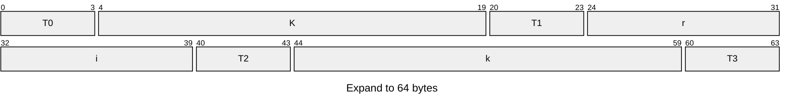

	
# What is cryptography

The three steps of cryptography (To prove this algorithm is reliable): 
* Precisely specify **threat model**.
* Propose a construction.
* Prove that ==breaking construction under threat model will solve an underlying hard problem==.

# The history of cryptography

## Symmetric Ciphers (對稱加密): 

A cipher defined over $(K, M, C)$ {K = all possible key, M = all possible message, and C = all possible ciphertext} is a pair of "efficient" algs (E, D) {**E** is often ==randomized==, and **D** is always ==deterministic==} where 
D(k, E(k, m)) = m. 

Note that: both the encryptor and the decryptor share the same key `k`. 

### Substitute cipher(替換加密法): 

#### Caesar cipher: 

**How to break the Caesar cipher?** 

(1) Use frequency of English letters. 

(2) Use frequency of pairs of letters. 

#### Vigener cipher: 

**How the Vigener cipher works?** 

Given that: 
	k = CRYPTO
	m = WHATANICEDAYTODAY

Encrypt: 

(1) Replicate k two times to fit m. 
	k = CRYPTOCRYPTOCRYPTO
	m = WHATANICEDAYTODAY

(2) Compute: $(k + m) mod \ 26$
	c = ZZZJUCLUDTUNNWGCQS

Decrypt: 

(1) Compute: $c - k$

**How to break the Vigener cipher?** 

First, we assume we have the size of k = 6. 

Second, we can break the ciphertext into groups of six letters each.

Third, we have to focus on the first character of each groups. We knew that these ciphertext were all encrypted by the same character `c`. 

We can collect all the characters and compute which one is the ==most common one==, and that character is most likely to correspond to the character 'e'. We can get the first character of the `k(key)` by calculating: $\boxed{Most \ common \ character - the \ character \ e = k[0]}$. Keep focusing on the second character of the ciphertext, we can solve the second character of k, and then we can get the entire key by continue doing so.

#### Rotor Machines (轉輪機)

**How the Rotor Machines works?** 

The key(map table) will **shift itself** once after the user typed. For example the key k = eklmn. After the user typed any character, the k will become: neklm. 

**How to break the Rotor Machines?** 

Also the same strategy we used before. 

# Discrete probability crash course

## Probability distribution

Def: **Probability distribution** P over U is a fucntion P: U -> $[0, 1]$, such that : $$\sum_{x \in U}P(x) = 1$$
Eample: 

1. Uniform distribution: for all $x \in U$: $P(x) = 1 / |U|$
2. Point distribution at $x_0$: $P(x_{0}) = 1, \forall x \neq x_{0}: P(x) = 0$ (Here we called "$\forall$": for all)

## An important property of XOR

> Y a rand. var. over $\{0, 1\}^n$, x an indep. uniform var. on $\{0, 1\}^n$
> Then $Z = Y\oplus X$ is uniform var. on $\{0, 1\}^n$. 

# Stream Cipher: making OTP practical

## The One Time Pad (OTP)

This is the first example of a "secure" cipher.

Key = rand. bit string as long as the msg.

**How The One Time Pad works?** 

c = E(k, m) = $k \oplus m$

D(k, c) = $k \oplus c$

**What makes the cipher secure?**  ^CipherSecure

Basic idea: Ciphertext should reveral no info about plaintext. 

Def: A cipher (E, D) over $(K, M, C)$ has perfect secrecy if: 

$$
\begin{align}
 & \forall _{m_{0}, m_{1}} \in M \ (len(m_{o}) = len(m_{1})) \ and \ \forall_{c} \in C \\
 & \boxed{P[E(k, m_{0})=c] = P[E(k, m_{1} = c)]}, \text{where k is uniform in K} \ (k \leftarrow^{r} K) \\
 & \implies \text{Given CT(ciphertext) can't tell if the msg is }m_{0} \ or \ m_{1}. \\ \\

 & \forall_{m, c}: P[E(k, m) = c] = \frac{\text{\#keys k}\in K \text{s.t. E(k, m)} = c}{|K|} \\
 & (\text{called "\#": number of}) \\
 & So: \forall_{m,c}: \boxed{\#\{ k \in K: E(k, m) = c \} = const.} \\
 & \implies \text{cipher has perf. sec.}
\end{align}
$$

To prove OTP has perfect secrecy: 

$$
\begin{align}
 & proof:  \\
 & \text{For OTP: if E(k, m) = c} \\
 & \implies k \oplus m = c \implies k = m \oplus c \\
 & \implies \forall_{m, c}\text{ we have: }\boxed{\#\{k \in K: E(k, m) = c \} = 1}  \\
 & \implies \text{OPT has perf. sec.} \\
 & \implies \text{No CT only attacks. }
\end{align}
$$

The bad news: perfect secrecy $\implies |K| \geq |M|$.

## Stream Ciphers and pseudorandom key

idea: reaplace random key by "pseudorandom" key. 

Pseudorandom Generator(PRG): is a func. $G: \{ 0,1 \}^{s}\to\{ 0,1 \}^{n}, n\gg s$ .

$C = E(k, m) = m\oplus G(k)$

Stream Ciphers ==cannot have prefect secercy==, because the key is smaller than the message. 

We say that $G: K\to\{ 0,1 \}^{n}$ is predictable if: 
	We can find a "efficient" func $A$ and an $i$ that satisfies the condition: $1 \leq i \leq n-1$
	$P[A(G(k))|_{1\dots i} = G(k)|_{i+1}] \geq \frac{1}{2} + \epsilon \left( \text{For some non-neg: }\epsilon \geq \frac{1}{2^{30}} \right)$

Def: PRG is **unpredictable** if it is not predictable. 
$\implies$ $\forall i$: no "eff" adv. can predict bit(i+1) for "non-neg" $\epsilon$.

### Weak  PRGs (do not use for crypto)

* Linear congruential generator: 
	It has three param. : a(int), b(int), p(prime). 
	
	First, we have `r[0]`, which is the seed. 
	`r[i]` = $(a \cdot r[i-1] + b) \ mod \ p$
	`output few bits of r[i]`
	`i++`

* glibc random()

## Attack on OTP and stream ciphers

### Attack 1: two time pad is insecure

(==Never use stream cipher key more than once! ==)

$$
\text{If we have: }
\boxed{
 \begin{align}
 & C_{1} \leftarrow m_{1} \oplus PRG(k) \\
 & C_{2} \leftarrow m_{2}\oplus PRG(k)
 \end{align}
}
$$
Eavesdropper does: 
$$
C_{1} \oplus C_{2} = m_{1} \oplus m_{2}
$$

Enough redundary in English and ASCII encoding that: 
$$
m_{1} \oplus m_{2} \to m_{1}, m_{2}
$$

* Network traffic: negotiate new key for every session (e.g. TLS)
* Disk encryption: typically do not use a stream cipher

### Attack 2: no integrity (OTP is malleable)

Modification to ciphertext are undetected and have predictable impact on plaintext. 

$$
\begin{align}
 & m \to m\oplus k \\
 & \text{Eavesdropper does: }(m\oplus k)\oplus p \\
 & \text{after decoded: }m\oplus p
\end{align}
$$

## RC4

Used in HTTPS and WEP

How it runs: 
1. Takes a variable size seed (Here we set to 128 bits for demonstration)
2. Expands the 128 bits key into 2048 bits(used as the internal state for the generator)
3. Run a simple loop, where every iteration of this loop outputs one byte. 

Weekness: 
* Bias in initail output: $P[2nd \ byte=0] = \frac{2}{256} \left( \frac{1}{256} \text{ If completly random} \right)$
* Possibility of (0, 0) is $\frac{1}{256^{2}} + \frac{1}{256^{3}}\left( \frac{1}{256^{2}}\text{ If complety random} \right)$
* Related key attacks(If one uses keys that closely related to one another, then it's actually possible to recover the root key)

## CSS (content scrambling system)

Linear feedback shift register(LFSR): 
	seed = initial state of LFSR
	LFSR is a register consist of 1 bytes.
	xor some certian position very clock cycle and shift right, the result of the xor will be added to the left. 

Example of LFSR(all broken): 
* DVD encryption (CSS): 2 LFSR
* GSM encryption (A51, A52): 3 LFSR
* Bluetooth(E0): 4 LFSR

### How the CSS works

CSS: seed = 5 bytes = 40 bits

key: 
	LFSR1(17 bits): 1 + first 2 bytes of seed
	LFSR2(25 bits): 1 + last 3 bytes of seed
	Both LFSR 1/2 shifts 8 times, and we can get 8 output bits. 
	We have to add these two result and mod by 256. 

![[Pasted image 20250429000015.png]]

(Easy to break roughly through $2^{17}$ times)

1. Suppose we have a ciphertext and the plaintext for the first 20 bytes has known.
2. xor the plaintext and the ciphertext, and we can know what is the result of PRG in the first 20 bytes.
3. We try $2^{17}$ possible value of LFSR1, and for each of the possible value we have to run LFSR for 20 bytes.
4. Since we have the PRG value of the first 20 bytes, we can subtract it from the result of LFSR1, so we can get the possible first 20 bytes of LFSR2.
5. We can judge whether the first 20 bytes of LFSR2 is correct, and get the right value of LFSR1 and LFSR2.
6. We can predict the remaining output of the PRG, and decode the ciphertext.

## eStream

PRG：$\{ 0, 1 \}^{s} \times R \to \{ 0, 1 \}^{n}, n\gg s$ (It takes two input: **seed** and **nonce**)

Nonce: A non-repeating value for a given key. 

E(k, m ; r) = $m \oplus PRG(k \ ; \ r)$, the pair (k, r) is never used more than once. 

### Salsa 20

Salsa20: $\{ 0, 1 \}^{128 \ or \ 256}\times\{ 0,1 \}\to\{ 0,1 \}^{n}$

Salsa20(k ; r) = H(k, (r, 0)) || H(k, (r, 1)) || ...

#### How the function H works? 

First, expand the state to 64 bytes. 

($T_{n}$ is a constant which is given by Salsa20, and $i$ is a self-incremental number)

It can also be view as a matrix: 
$$
\begin{bmatrix}
T_{0} & K_{0} & K_{1} & K_{2} \\
K_{3} & T_{1} & R_{0} & R_{1} \\
i_{0} & i_{1} & T_{2} & K_{4} \\
K_{5} & K_{6} & K_{7} & T_{3}
\end{bmatrix}
$$
After we got the matrix, we can apply a fuction called "**quarter-round**" to the initial matrix 10 times and get a final matrix. 

At last, we add the initial matrix and the final matrix together. This output is the final key. 

# What is a secure cipher? 

## PRG Security Defs

**Goal**: Define what is means that $[k \leftarrow^{R}K\text{, output G(k)}]$ is "**indistinguishalbe**" from $[r\leftarrow^{R}\{ 0,1 \}^{n}\text{, output r}]$. 

**Statistical test** on $\{ 0,1 \}^{n}$: 
	an alg. A s.t. A(x) outputs "0" or "1". 
	"0": x is not random.
	"1": x is random.

### Advantage

Define: 
	$Adv_{PRG}[A, G] = \boxed{|P_{K\leftarrow^{R}K}[A(G(k)) = 1] - P_{r\leftarrow^{R}\{0,1\}^{n}}[A(r)=1]|} \in [0,1]$
	Adv close to 1 -> A can distinguish G from random.
	Adv close to 0 -> A cannot distingush G from random. 

### Secure PRGs: crypto definition

Def: We say that G:K $\to$ $\{ 0,1 \}^{n}$ is a secure PRG if
$$
\begin{align}
 & \forall\text{ eff stat. tests A}:  \\
 &  Adv_{PRG}[A, G]\text{ is neg.}
\end{align}
$$

### More Generally

Let $P_{1}$ and $P_{2}$ be two distributions over $\{0,1\}^{n}$.

Def: We say that $P_{1}$ and $P_{2}$ are **computational indistinguishable** (denoted $\boxed{P_{1} \approx_{p} P_{2}}$)

Example: a PRG is secure if $\boxed{\{k\leftarrow^{R}K: G(k)\}\approx_{p}\text{uniform}(\{0,1\})^{n}}$. 

## Semantic security

### What is a secure cipher? 

Recall Shannon's idea: ==Ciphertext should reveal no "info" about plaintext. ==

[[Section 1#^CipherSecure]]

Since "Perfect secrecy" is hard to satisfy, here we define a new concept of secure: 

$$
\begin{align}
 & \text{(E, D) has perfect secrecy if: }  \\
 & \forall m_{0}, m_{1} \in M (|m_{0}| = |m_{1}|) \\
 & \boxed{\{ E(k, m_{0}) \}\approx_{p}\{ E(k, m_{1}) \}}
\end{align}
$$

(but also need adversary to exhibit $m_{0}, m_{1}\in M$ explicitly)

### Semantic security (one-time key)

For b = 0, 1  define experiments EXP(0) and EXP(1) as: 
![[Pasted image 20250504191335.png]]

$$Adv_{ss}[A, E] = |P[W_{0}] - P[W_{1}]| \in [0,1]$$
Def: $E$ is semantically security if for all "efficient" A $Adv_{ss}[A,E]$ is "negligible". 

$\implies$ for all explicit $m_{0}, m_{1} \in M$: $\{E(k, m_{0})\} \approx_{p} \{E(k, m_{1})\}$

## Stream ciphers are semantically secure

$\forall$sem. sec. adversary A, $\exists$ (exists) a PRG adversary B s.t.

$$
\boxed{Adv_{ss}[A,E] \leq 2 \cdot Adv_{PRG}[B, G]}
$$

Claim 1: $|P[R_{0}] -P[R_{1}]| = Adv_{ss}(A, OTP) = 0$

Claim 2: $\exists B: |P[W_{0}] - P[R_{0}]| = Adv_{PRG}[B, G]$($P[W_{0}]$ is the possiblity under pseudorandom key, $P[R_{0}]$ is the possiblity under truely random key)

![[Pasted image 20250504195343.png]]

$\implies Adv_{ss}[A, E] = |P[W_{0}]-P[W_{1}]| \leq 2 \cdot Adv_{PRG}[B,G]$

Proof of Claim 2: 

$$
\boxed{
\begin{align}
 & Adv_{PRG}[B,G]  \\
 & = |P_{r\leftarrow\{0,1\}^{n}}[B(r)=1] - P_{k\leftarrow K}\{B(G(k))=1\}| \\
 & = |P[R_{0}] - P[W_{0}]|
\end{align}
}
$$
